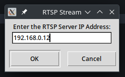
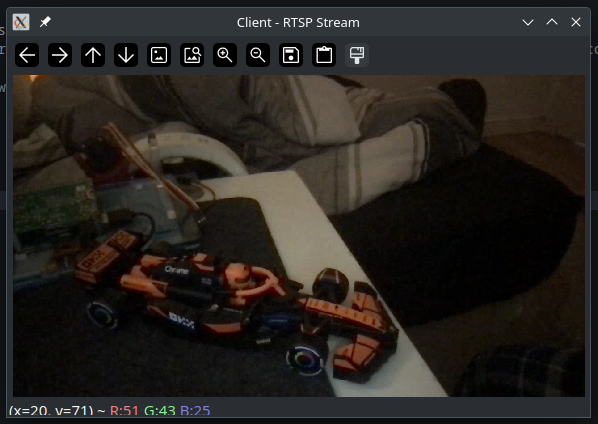
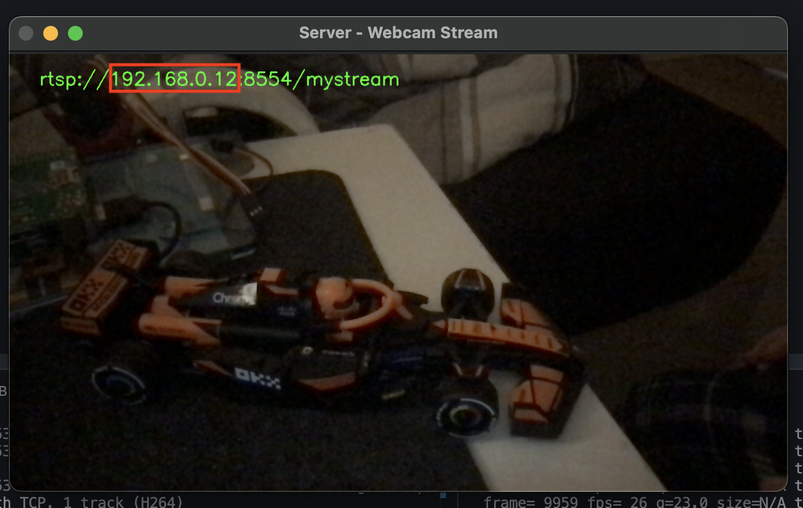

# Client Side RTSP Viewer

## Overview
This client-side script connects to an RTSP stream served by a video server (such as MediaMTX) and displays the live video feed using OpenCV. It uses a simple GUI built with Tkinter to prompt the user for the server's IP address, constructs the RTSP URL, and then opens the stream in a resizable window.

## Features
- **User Input via GUI:** Prompts the user to enter the RTSP server IP address.
- **RTSP Stream Connection:** Uses OpenCV to open and display the RTSP stream.
- **Resizable Display Window:** Opens the video stream in a resizable window (default size 800x600).
- **Simple Exit Mechanism:** Press 'q' to exit the video stream and clean up resources.

## Requirements
- Python 3.x
- [OpenCV](https://pypi.org/project/opencv-python/)
- Tkinter (typically included with Python)
- An RTSP server (e.g., [MediaMTX](https://github.com/MediaMTX/MediaMTX)) that provides a stream at `rtsp://<server-ip>:8554/mystream`

## How to Use
1. **Start Your RTSP Server:**  
   Ensure your RTSP server (e.g., MediaMTX) is running and accessible.
   
2. **Run the Client Script:**  
   Execute the script with:
   ```bash
   python client.py
   ```
   
3. **Enter the Server IP:**  
   A dialog box will appear asking for the server IP address. Enter the correct IP and click OK.
   
4. **View the Stream:**  
   The client will connect to the RTSP stream (`rtsp://<server-ip>:8554/mystream`) and display the video in a window.
   
5. **Exit:**  
   Press 'q' on the keyboard while the video window is active to close the stream and exit.

## Code Explanation
- **User Input (Tkinter):**  
  The script uses Tkinter’s `simpledialog` to prompt for the RTSP server IP, which is then used to construct the full stream URL.
  
- **RTSP Stream Capture (OpenCV):**  
  OpenCV's `VideoCapture` function opens the RTSP stream, and frames are read in a loop.
  
- **Display Window:**  
  A resizable window (800x600 by default) is created using OpenCV to show the live video feed.
  
- **Resource Cleanup:**  
  When the user presses 'q', the script stops capturing frames, releases the stream, and destroys the window.

## How the Server Serves the Video Feed (Brief Overview)
The server side uses:
- **OpenCV:** To capture video frames from a webcam.
- **FFmpeg:** To encode these frames (using H.264) and push the stream to an RTSP endpoint.
- **MediaMTX:** Formerly known as rtsp-simple-server, this server receives the stream and distributes it to clients via the RTSP protocol.
  
This combination allows for efficient streaming over a local network with support for multiple clients.

## Screenshots
Below are some screenshots of the program working on linux:

- **GUI Input Dialog:**  
  

- **Client Video Feed Window:**  
  

- **Server Video Feed Window:**  
  